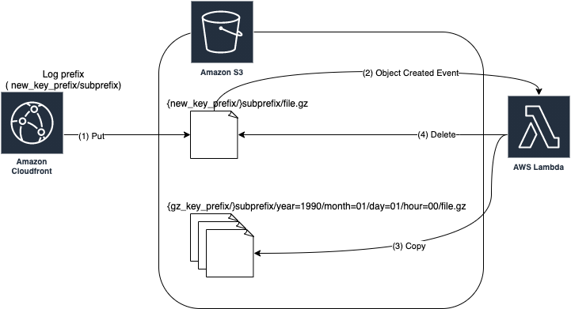

# terraform-aws-cloudfront-access-logs-to-hive-format
A Terraform template that move CloudFront Access Logs to Hive format for Athena.

## Reference

- [aws-samples/amazon-cloudfront-access-logs-queries](https://github.com/aws-samples/amazon-cloudfront-access-logs-queries)
    - "This moves the file to an Apache Hive style prefix." part

### Changes

- CloudFormation stack to TerraForm
- Use only moveAccessLogs
- Keep the prefix and put it in front of the datetime

## Overview

- e.g.
    - CloudFront logging setting:
        - S3 bucket: example-bucket
        - Log prefix: raw/example.com
    - Inputs:
        - new_key_prefix: raw/
        - gz_key_prefix: partitioned-gz/
    - Result:
        - source:
            - s3://example-bucket/raw/example.com/XXXXXXXXXXXXX.1990-01-01-00.XXXXXXXX.gz
        - destination:
            - S3: s3://example-bucket/partitioned-gz/example.com/year=1990/month=01/day=01/hour=00/XXXXXXXXXXXXX.1990-01-01-00.XXXXXXXX.gz

## Requirements

| Name | Version |
|------|---------|
|  [terraform](#requirement\_terraform) | >= 1.0.4 |
|  [aws](#requirement\_aws) | >= 3.52 |

## Providers

| Name | Version |
|------|---------|
|  [archive](#provider\_archive) | n/a |
|  [aws](#provider\_aws) | n/a |

## Modules

No modules.

## Resources

| Name | Type |
|------|------|
| [aws_cloudwatch_log_group.this](https://registry.terraform.io/providers/hashicorp/aws/latest/docs/resources/cloudwatch_log_group) | resource |
| [aws_iam_role.this](https://registry.terraform.io/providers/hashicorp/aws/latest/docs/resources/iam_role) | resource |
| [aws_iam_role_policy.this](https://registry.terraform.io/providers/hashicorp/aws/latest/docs/resources/iam_role_policy) | resource |
| [aws_iam_role_policy_attachment.lambda_basic_execution_role](https://registry.terraform.io/providers/hashicorp/aws/latest/docs/resources/iam_role_policy_attachment) | resource |
| [aws_lambda_function.this](https://registry.terraform.io/providers/hashicorp/aws/latest/docs/resources/lambda_function) | resource |
| [aws_lambda_permission.this](https://registry.terraform.io/providers/hashicorp/aws/latest/docs/resources/lambda_permission) | resource |
| [aws_s3_bucket_notification.this](https://registry.terraform.io/providers/hashicorp/aws/latest/docs/resources/s3_bucket_notification) | resource |
| [archive_file.this](https://registry.terraform.io/providers/hashicorp/archive/latest/docs/data-sources/file) | data source |
| [aws_iam_policy_document.this](https://registry.terraform.io/providers/hashicorp/aws/latest/docs/data-sources/iam_policy_document) | data source |
| [aws_iam_policy_document.this_assume_role_policy](https://registry.terraform.io/providers/hashicorp/aws/latest/docs/data-sources/iam_policy_document) | data source |

## Inputs

| Name | Description | Type | Default | Required |
|------|-------------|------|---------|:--------:|
|  [create\_s3\_bucket\_notification](#input\_create\_s3\_bucket\_notification) | S3 Buckets only support a single notification configuration. ref.[aws\_s3\_bucket\_notification](https://registry.terraform.io/providers/hashicorp/aws/latest/docs/resources/s3_bucket_notification) | `bool` | `true` | no |
|  [lambda\_function\_log\_retention\_in\_days](#input\_lambda\_function\_log\_retention\_in\_days) | Possible values are: 1, 3, 5, 7, 14, 30, 60, 90, 120, 150, 180, 365, 400, 545, 731, 1827, 3653, and 0(never) | `number` | `30` | no |
|  [lambda\_function\_runtime](#input\_lambda\_function\_runtime) | n/a | `string` | `"nodejs14.x"` | no |
|  [lambda\_function\_timeout](#input\_lambda\_function\_timeout) | n/a | `number` | `30` | no |
|  [name\_prefix](#input\_name\_prefix) | Prefix that is used for the created resources. If specified, it will be '{name\_prefix}-{name\_suffix}' | `string` | `""` | no |
|  [name\_suffix](#input\_name\_suffix) | Suffix that is used for the created resources. | `string` | `"move-cf-access-logs"` | no |
|  [s3\_bucket\_gz\_key\_prefix](#input\_s3\_bucket\_gz\_key\_prefix) | Prefix of gzip'ed access log files that are moved to the Apache Hive like style. Including the trailing slash | `string` | `"partitioned-gz/"` | no |
|  [s3\_bucket\_name](#input\_s3\_bucket\_name) | Bucket Name of access log files that are written by Amazon CloudFront | `string` | n/a | yes |
|  [s3\_bucket\_new\_key\_prefix](#input\_s3\_bucket\_new\_key\_prefix) | Prefix of new access log files that are written by Amazon CloudFront. Including the trailing slash. | `string` | `"raw/"` | no |

## Outputs

| Name | Description |
|------|-------------|
|  [function\_arn](#output\_function\_arn) | The ARN of the Lambda Function |
